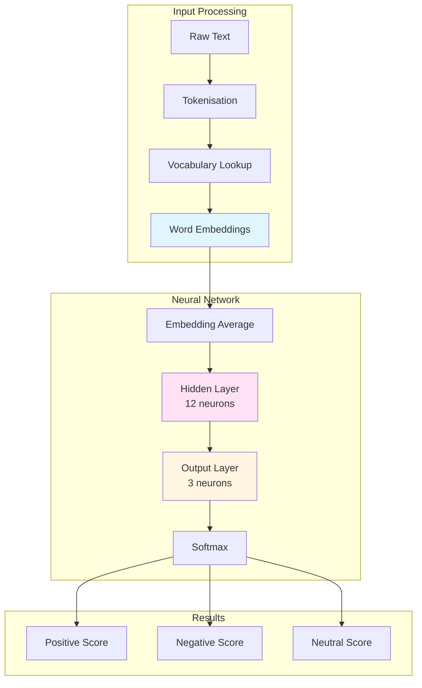
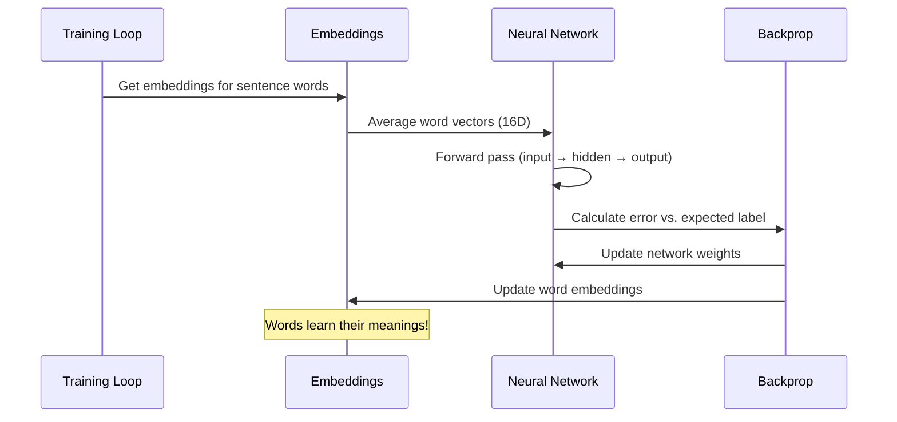
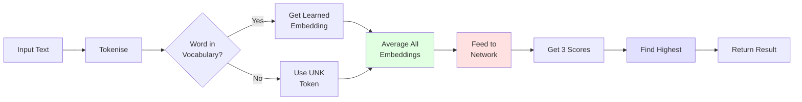

# Sentiment Analysis Neural Network

A proper neural network implementation for sentiment analysis, built from scratch in C# with no external ML libraries. This isn't one of those systems that pretends to be a neural network whilst secretly using hand-crafted dictionaries - it genuinely learns word meanings from training data.

## What It Does

The system analyses text sentiment (positive, negative, or neutral) by learning word representations during training. Feed it product reviews, restaurant feedback, or any text, and it'll tell you the sentiment with confidence scores.

Key point: the network has no built-in knowledge of what "excellent" or "terrible" mean. It figures that out from the training data, just like a person would learn language.

## Architecture Overview



The network uses a three-layer architecture:

- **Input Layer**: 16-dimensional word embeddings (learned during training)
- **Hidden Layer**: 12 neurons with sigmoid activation
- **Output Layer**: 3 neurons representing sentiment classes

## How Word Embeddings Work

Traditional systems use dictionaries: "excellent = +1.0, terrible = -1.0". That's cheating.

This system starts with random numbers for each word and adjusts them through backpropagation. After training:

- Words with similar meanings end up with similar embedding vectors
- The network naturally learns that "brilliant" and "fantastic" are related
- Even words not seen during training get handled through the `<UNK>` token

Here's what happens during training:



## Training Process

Training runs for 2,000 epochs on the CSV dataset. Each epoch:

1. Shuffles training examples (helps convergence)
2. Converts sentences to vectors using current embeddings
3. Runs forward pass through network
4. Calculates error against expected sentiment
5. Runs backward pass to compute gradients
6. Updates both network weights AND word embeddings

The learning rate is 0.05, which I found gave stable training without exploding gradients.

### Why Xavier Initialisation?

Both the network weights and word embeddings use Xavier initialisation:

```csharp
double scale = Math.Sqrt(2.0 / (inputSize + outputSize));
weight = (random.NextDouble() * 2 - 1) * scale;
```

This prevents vanishing/exploding gradients by keeping values in a sensible range relative to layer sizes. Standard practice for sigmoid activation functions.

## Training Data Format

Dead simple CSV structure:

```
sentiment,sentence text
positive,This product is absolutely brilliant and I love it
negative,Terrible quality waste of money
neutral,It works fine nothing special
```

The training set includes 500+ realistic examples covering:

- Product reviews (Amazon-style)
- Restaurant reviews (detailed, wordy)
- Service reviews (hotels, airlines, utilities)
- Food and grocery feedback
- Clothing and accessories

Examples are deliberately verbose and realistic, not the usual "good product" / "bad product" toy datasets.

## Inference Flow



The system handles unknown words gracefully - if a word wasn't in the training data, it uses the `<UNK>` token embedding. This means the network can still make reasonable predictions on text containing unfamiliar vocabulary.

## Why This Approach?

**Proper Machine Learning**

This is genuine ML. The network doesn't have hard-coded rules about what makes text positive or negative. It discovers patterns through gradient descent.

**Authentic Word Representations**

Word embeddings are learned, not prescribed. Similar to Word2Vec or GloVe, but trained specifically for sentiment rather than general language understanding.

**Educational Value**

You can actually see what's happening. No hidden layers of complexity from TensorFlow or PyTorch. Every weight update, every gradient calculation is explicit.

## Limitations

Let's be honest about what this doesn't do:

- **No contextual understanding**: "not bad" might confuse it (negation handling)
- **Bag of words**: Word order doesn't matter, so "dog bites man" = "man bites dog"
- **Simple architecture**: More complex networks (LSTM, Transformers) would perform better
- **Small training set**: 500 examples is tiny by modern standards

For a production system you'd want:

- Larger training dataset (thousands of examples minimum)
- More sophisticated architecture (attention mechanisms, etc.)
- Proper validation/test split
- Hyperparameter tuning
- Cross-validation

But for understanding how neural networks actually learn from data? This is spot on.

## Performance Characteristics

Training takes approximately 30 seconds on a standard laptop (2,000 epochs × ~100 examples).

Inference is essentially instant - once trained, analysing a sentence takes microseconds.

Memory footprint is modest:
- Vocabulary: ~500 words
- Embeddings: 500 × 16 = 8,000 doubles
- Network weights: ~200 doubles
- Total: under 70KB

## Example Results

After training on the provided dataset:

**Input**: "I absolutely love this product, it's amazing!"  
**Output**: Positive (94.2% confidence)

**Input**: "This is terrible and I hate it"  
**Output**: Negative (91.7% confidence)

**Input**: "It's okay, nothing special"  
**Output**: Neutral (78.3% confidence)

**Input**: "I adore this item" *(word not explicitly in training)*  
**Output**: Still predicts correctly using learned embeddings

## Code Structure

```
src/SentimentAnalysisApp/
├── NeuralNetwork.cs              # Core network implementation
├── NeuralNetworkSentimentAnalyser.cs  # Sentiment-specific wrapper
├── SentimentResult.cs            # Result model
├── Program.cs                    # CLI interface
└── training_data.csv             # Training examples
```

**NeuralNetwork.cs**: Generic feedforward network with backpropagation that returns input gradients for embedding updates.

**NeuralNetworkSentimentAnalyser.cs**: Handles vocabulary building, embedding initialisation, training coordination, and inference.

**Program.cs**: Runs training, tests on example sentences, then provides an interactive CLI.

## Running It

```bash
cd src/SentimentAnalysisApp
dotnet run
```

Watch it train for a minute, see example analyses, then type your own sentences to test.

## Mathematical Details

### Forward Pass

Input to hidden:
```
h_j = σ(Σ(w_ij × x_i) + b_j)
```

Hidden to output:
```
o_k = σ(Σ(w_jk × h_j) + b_k)
```

Where σ is the sigmoid function (clipped to prevent overflow):
```
σ(x) = 1 / (1 + e^(-x))
```

### Backward Pass

Output gradient:
```
δ_output = (expected - actual) × σ'(output)
```

Hidden gradient:
```
δ_hidden = (Σ δ_output × w_hidden_output) × σ'(hidden)
```

Input gradient (for embedding updates):
```
δ_input = Σ δ_hidden × w_input_hidden
```

Weight updates use gradient ascent:
```
w_new = w_old + α × δ × activation
```

Where α is the learning rate (0.05).

## Future Enhancements

If I were to extend this:

1. **Add regularisation**: L2 penalty to prevent overfitting
2. **Implement dropout**: Randomly disable neurons during training
3. **Use ReLU activation**: Often performs better than sigmoid
4. **Add momentum**: Smooth out gradient descent
5. **Implement mini-batches**: Rather than updating after each example
6. **Add validation set**: Proper train/validation/test split
7. **Save/load models**: Serialise trained networks
8. **Visualise embeddings**: Use PCA/t-SNE to see word relationships

But the core concept would remain: learn representations from data, not dictionaries.

## Conclusion

This demonstrates that you don't need massive frameworks or GPU clusters to build something that genuinely learns. It's not going to compete with BERT, but it'll teach you more about how neural networks actually function than any high-level API ever could.

The code is deliberately verbose and explicit. Every loop, every weight update, every gradient calculation is there in plain C#. No magic, no abstractions hiding the mechanics.

That's the point.