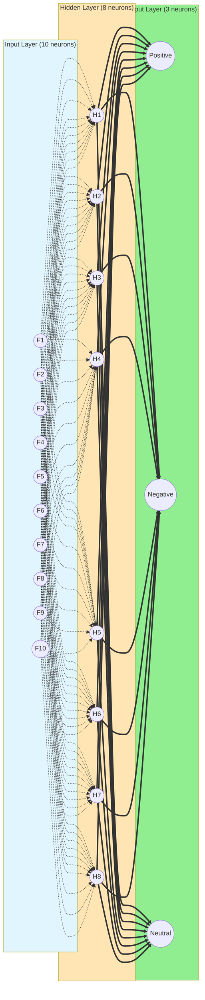
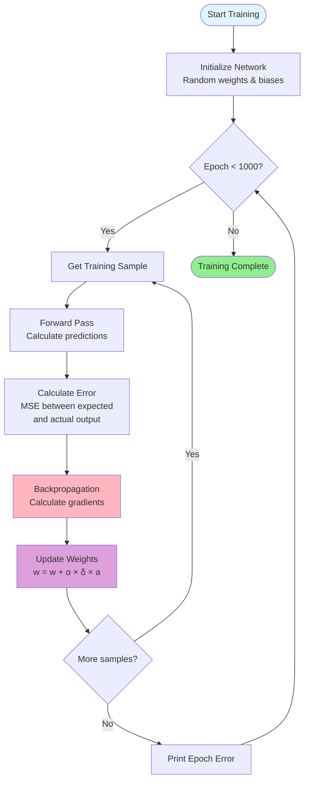
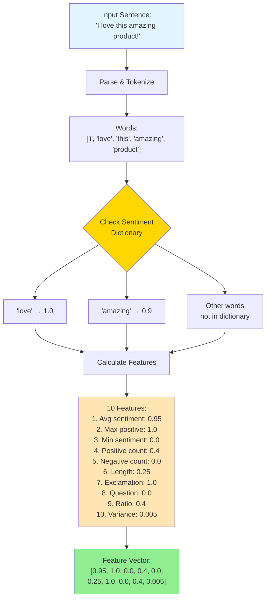
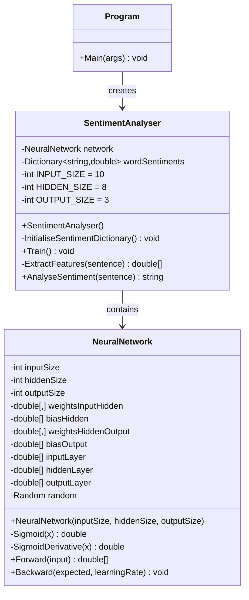
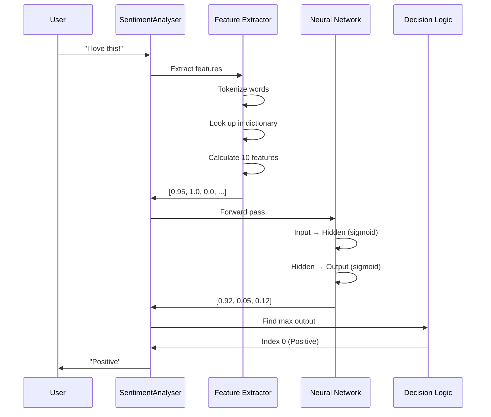

# Sentiment Analysis Neural Network - Architecture Diagram

## Complete System Flow

```mermaid
flowchart TB
    Start([Input: "I love this product!"]) --> Extract[Feature Extraction]
    
    Extract --> F1[Feature 1: Avg Sentiment<br/>Score: 0.8]
    Extract --> F2[Feature 2: Max Positive<br/>Score: 1.0]
    Extract --> F3[Feature 3: Min Sentiment<br/>Score: 0.0]
    Extract --> F4[Feature 4: Positive Words<br/>Count: 0.2]
    Extract --> F5[Feature 5: Negative Words<br/>Count: 0.0]
    Extract --> F6[Feature 6: Length<br/>Score: 0.2]
    Extract --> F7[Feature 7: Exclamation<br/>Score: 1.0]
    Extract --> F8[Feature 8: Question Mark<br/>Score: 0.0]
    Extract --> F9[Feature 9: Sentiment Ratio<br/>Score: 0.5]
    Extract --> F10[Feature 10: Variance<br/>Score: 0.0]
    
    F1 --> NN[Neural Network]
    F2 --> NN
    F3 --> NN
    F4 --> NN
    F5 --> NN
    F6 --> NN
    F7 --> NN
    F8 --> NN
    F9 --> NN
    F10 --> NN
    
    NN --> O1[Output 1: Positive<br/>Score: 0.92]
    NN --> O2[Output 2: Negative<br/>Score: 0.05]
    NN --> O3[Output 3: Neutral<br/>Score: 0.12]
    
    O1 --> Decision{Find Highest<br/>Output}
    O2 --> Decision
    O3 --> Decision
    
    Decision --> Result([Result: "Positive"])
    
    style Start fill:#e1f5ff
    style Result fill:#90EE90
    style NN fill:#FFE5B4
    style Extract fill:#FFD700
    style Decision fill:#DDA0DD
```

## Neural Network Internal Architecture



## Training Process Flow



## Forward Propagation Detail

```mermaid
flowchart LR
    subgraph Input["Input (10 features)"]
        I[Input Vector<br/>x₁, x₂, ..., x₁₀]
    end
    
    subgraph Hidden["Hidden Layer Calculation"]
        W1[Weights Matrix<br/>W⁽¹⁾ [10×8]]
        B1[Bias Vector<br/>b⁽¹⁾ [8]]
        Sum1[Σ = W⁽¹⁾·x + b⁽¹⁾]
        Act1[Sigmoid<br/>h = σ(Σ)]
    end
    
    subgraph Output["Output Layer Calculation"]
        W2[Weights Matrix<br/>W⁽²⁾ [8×3]]
        B2[Bias Vector<br/>b⁽²⁾ [3]]
        Sum2[Σ = W⁽²⁾·h + b⁽²⁾]
        Act2[Sigmoid<br/>y = σ(Σ)]
    end
    
    subgraph Result["Result"]
        Y[Output Vector<br/>y₁, y₂, y₃]
    end
    
    I --> W1
    W1 --> Sum1
    B1 --> Sum1
    Sum1 --> Act1
    Act1 --> W2
    W2 --> Sum2
    B2 --> Sum2
    Sum2 --> Act2
    Act2 --> Y
    
    style Input fill:#e1f5ff
    style Hidden fill:#FFE5B4
    style Output fill:#FFD700
    style Result fill:#90EE90
```

## Backpropagation Detail

```mermaid
flowchart RL
    subgraph Expected["Expected Output"]
        E[Target Vector<br/>t₁, t₂, t₃]
    end
    
    subgraph OutputError["Output Layer Error"]
        Err[Error = t - y]
        Delta2[δ⁽²⁾ = Error × σ'(y)]
    end
    
    subgraph UpdateOutput["Update Output Weights"]
        UpdateW2[W⁽²⁾ += α × δ⁽²⁾ × h]
        UpdateB2[b⁽²⁾ += α × δ⁽²⁾]
    end
    
    subgraph HiddenError["Hidden Layer Error"]
        BackErr[Error = δ⁽²⁾ · W⁽²⁾ᵀ]
        Delta1[δ⁽¹⁾ = Error × σ'(h)]
    end
    
    subgraph UpdateHidden["Update Hidden Weights"]
        UpdateW1[W⁽¹⁾ += α × δ⁽¹⁾ × x]
        UpdateB1[b⁽¹⁾ += α × δ⁽¹⁾]
    end
    
    E --> Err
    Err --> Delta2
    Delta2 --> UpdateW2
    Delta2 --> UpdateB2
    Delta2 --> BackErr
    BackErr --> Delta1
    Delta1 --> UpdateW1
    Delta1 --> UpdateB1
    
    style Expected fill:#FFB6C1
    style OutputError fill:#DDA0DD
    style UpdateOutput fill:#FFD700
    style HiddenError fill:#DDA0DD
    style UpdateHidden fill:#FFD700
```

## Feature Extraction Detail



## Class Structure



## Data Flow Summary



## Legend

- **Dotted lines** (-.->): Many-to-many connections (each input connects to each hidden neuron)
- **Thick lines** (==>): Weighted connections with learned parameters
- **Rectangles**: Processing steps
- **Circles**: Neural network neurons
- **Diamonds**: Decision points
- **Rounded boxes**: Start/End points
